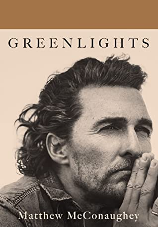

## Book Description

I’ve been in this life for fifty years, been trying to work out its riddle for forty-two, and been keeping diaries of clues to that riddle for the last thirty-five. Notes about successes and failures, joys and sorrows, things that made me marvel, and things that made me laugh out loud. How to be fair. How to have less stress. How to have fun. How to hurt people less. How to get hurt less. How to be a good man. How to have meaning in life. How to be more me.