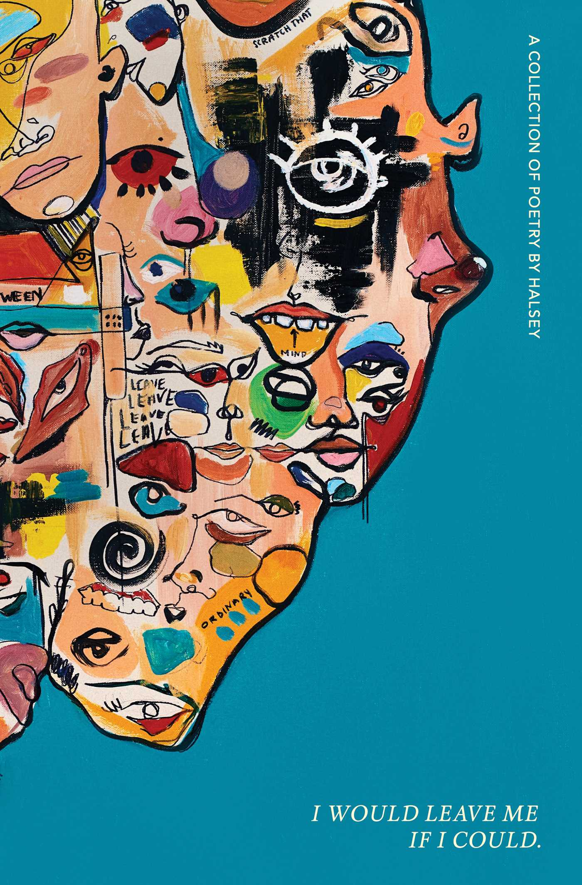

## Book Description

In this debut collection, Halsey bares her soul. Bringing the same artistry found in her lyrics, Halsey’s poems delve into the highs and lows of doomed relationships, family ties, sexuality, and mental illness. More hand grenades than confessions, these autobiographical poems explore and dismantle conventional notions of what it means to be a feminist in search of power.