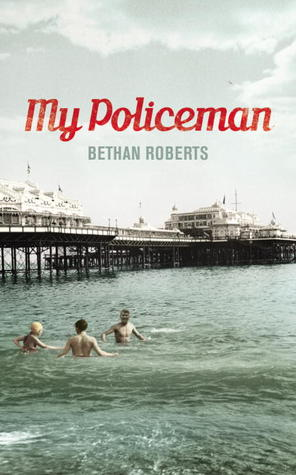

## Book Description

From the moment Marion first lays eyes on Tom - her best friend's big brother, broad, blond, blue-eyed - she is smitten. And when he comes home from National Service to be a policeman, Marion, a newly qualified teacher, is determined to win him. Unable to acknowledge the signs that something is amiss, she plunges into marriage, sure that her love is enough for both of them...

But Tom has another life, another equally overpowering claim on his affections. Patrick, a curator at the Brighton Museum, is also besotted with his policeman, and opens Tom's eyes to a world previously unknown to him. But in an age when those of 'minority status' were condemned by society and the law, it is safer for this policeman to marry his teacher. The two lovers must share him, until one of them breaks and three lives are destroyed.

Unfolding through the dual narratives of Marion and Patrick, both writing about the man at the centre of their lives, this beautifully-told, painful, tragic story is revealed.It is a tale of wasted years, misguided love and thwarted hope, of how at a time when the country was on the verge of change so much was still impossible.