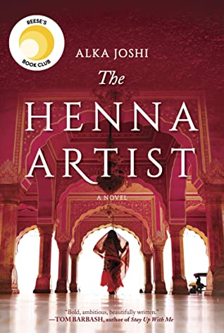

## Book Description

Escaping from an abusive marriage, seventeen-year-old Lakshmi makes her way alone to the vibrant 1950s pink city of Jaipur. There she becomes the most highly requested henna artist—and confidante—to the wealthy women of the upper class. But trusted with the secrets of the wealthy, she can never reveal her own…

Known for her original designs and sage advice, Lakshmi must tread carefully to avoid the jealous gossips who could ruin her reputation and her livelihood. As she pursues her dream of an independent life, she is startled one day when she is confronted by her husband, who has tracked her down these many years later with a high-spirited young girl in tow—a sister Lakshmi never knew she had. Suddenly the caution that she has carefully cultivated as protection is threatened. Still she perseveres, applying her talents and lifting up those that surround her as she does.