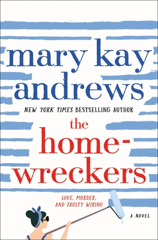

## Book Description

Hattie Kavanaugh went to work helping clean up restored homes for Kavanaugh & Son Restorations at 18; married the boss’s son at 20; and was only 25 when her husband, Hank, was killed in a motorcycle accident.
Broken-hearted, but determined to continue the business of their dreams, she takes the life insurance money, buys a small house in a gentrifying neighborhood, flips it, then puts the money into her next project. But that house is a disaster and a money-loser, which rocks her confidence for years to come. Then, Hattie gets a once-in-a-lifetime opportunity: star in a beach house renovation reality show called The Homewreckers, cast against a male lead who may be a love interest, or maybe the ultimate antagonist. It's a question of who will flip, who will flop and who will Hattie ever get her happily-ever-after.