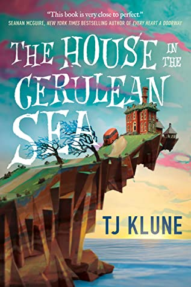

## Book Description

Linus Baker leads a quiet, solitary life. At forty, he lives in a tiny house with a devious cat and his old records. As a Case Worker at the Department in Charge Of Magical Youth, he spends his days overseeing the well-being of children in government-sanctioned orphanages.

When Linus is unexpectedly summoned by Extremely Upper Management he's given a curious and highly classified assignment: travel to Marsyas Island Orphanage, where six dangerous children reside: a gnome, a sprite, a wyvern, an unidentifiable green blob, a were-Pomeranian, and the Antichrist. Linus must set aside his fears and determine whether or not they’re likely to bring about the end of days.