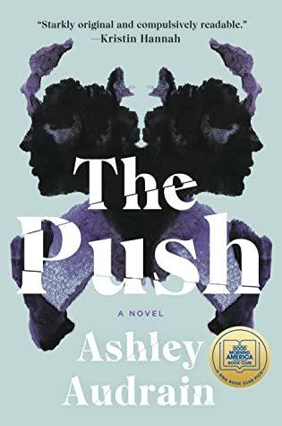

## Book Description

Blythe Connor is determined that she will be the warm, comforting mother to her new baby Violet whom she never had.

But in the thick of motherhood’s exhausting early days, Blythe becomes convinced that something is wrong with her daughter–she doesn’t behave as most children do.

Or is it all in Blythe’s head? Her husband, the Fox, says she’s imagining things. The more Fox dismisses her fears, the more Blythe begins to question her sanity, and the more we begin to question what Blythe is telling us about her life as well.

Then their son Sam is born–and with him, Blythe has the blissful connection she’d always imagined with her child. Even Violet seems to love her little brother. But when life as they know it is changed in an instant, the devastating fall-out forces Blythe to face the truth.